# PROJECT : AWS S3 SECURITY MONITORING – DATA EXFILTRATION & PUBLIC ACCESS DETECTION

## CLOUD-NATIVE SECURITY MONITORING SOLUTION FOR AWS S3

## INTRODUCTION
In this project, I implemented a cloud-native security monitoring solution for AWS S3 using CloudTrail, CloudWatch Logs, Metric Filters, and Alarms.
The goal was to detect:
-	Public exposure of a sensitive bucket (control-plane / management events)
-	Object-level activity such as downloads, uploads, deletions (data-plane / data events)
This setup mimics real-world SOC detection workflows, allowing near-real-time alerts for suspicious S3 activity.

## PROJECT OBJECTIVES
-	Enable CloudTrail logging for S3 management and data events
-	Configure CloudWatch metric filters to detect risky bucket changes and data access
-	Create CloudWatch alarms to notify of potential security issues
-	Test and validate that alerts are triggered by relevant actions
-	Gain hands-on experience with AWS control-plane and data-plane monitoring

# 
STEPS INVOLVED

## STEP 1 – CREATING THE S3 BUCKET
-	I created an s3 bucket named “sensitivedata101”.
-	This was the bucket intended to hold the sensitive objects that must be protected
-	I uploaded some file into the bucket

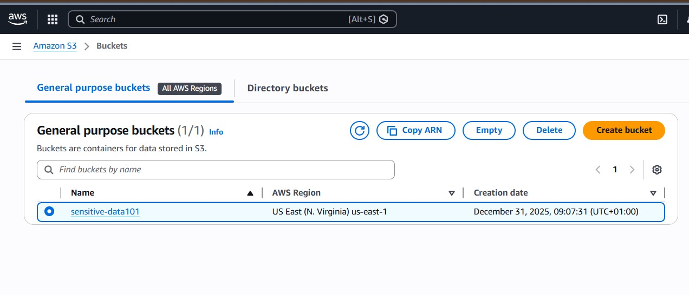

## STEP 2 – CREATING A TRAIL IN CLOUDTRAIL
-	I created a trail on CloudTrail for management event and data events
-	Since the goal is to log data events for a particular s3 bucket, I made sure to select CUSTOM in the log selector option.
-	In the Advanced event selector, I choose the resource arn, starts with, and then inputted my bucket ARN. 
-	I also Enabled CloudWatch logging
-	An IAM role was automatically created for me to enable proper logging to CloudWatch

## STEP 3 – LOG GROUP AND LOG VALIDATION
-	I verified that CloudTrail logs were being sent to CloudWatch Logs for near-real-time monitoring.
-	The log groups was created automatically and logs available
-	I created another s3 bucket and uploaded some file and checked the logs once again to make sure that the data events weren’t being logged, this ensures that only the data events of the intended s3 bucket is the one being logged.

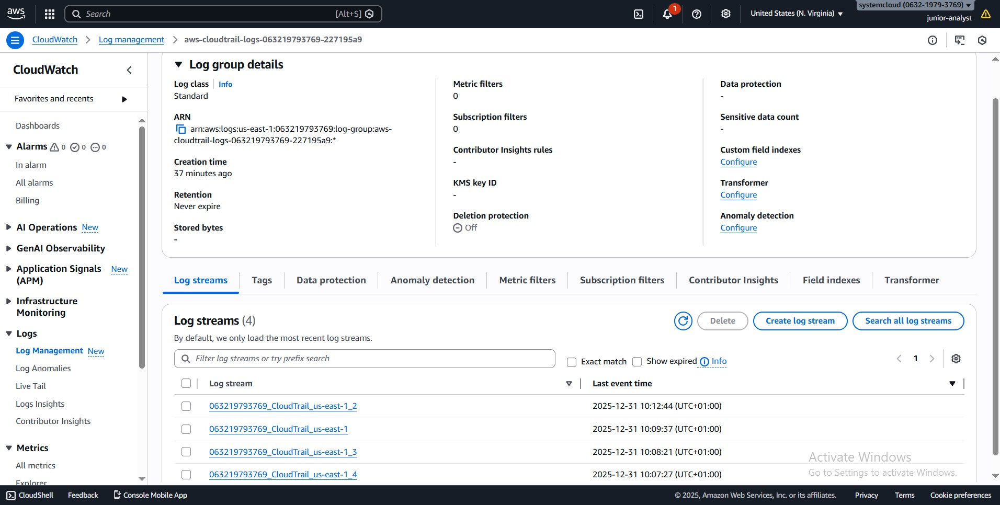

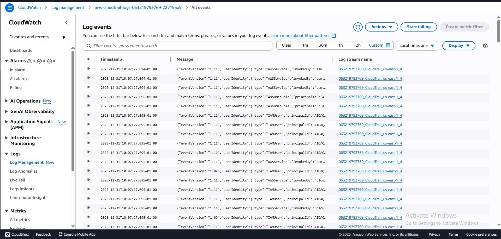

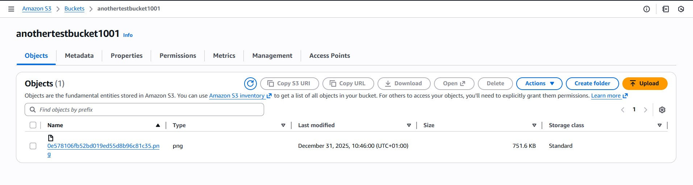

## STEP 4 – CREATING METRIC FILTERS
I created 3 different metric filters to detect different activities which includes:

**Detecting Public Access Changes (Management Events)**

- I wanted to detect any changes that made my bucket more public.
-	I created a metric filter for PutBucketPublicAccessBlock targeting my bucket.

**Detecting Data Exfiltration and Object Activity (Data Events)**

I wanted to monitor all object-level actions in my bucket. I created a comprehensive metric filter for:

- GetObject (downloads / exfiltration)
- PutObject (uploads / potential malware or data injection)
- DeleteObject (deletions / tampering)
- CopyObject (object duplication)
- PutObjectAcl (permission changes)

**Detecting Anonymous Access**

- I also wanted to catch any unauthenticated access.
- I created a metric filter for userIdentity.type = "Anonymous"

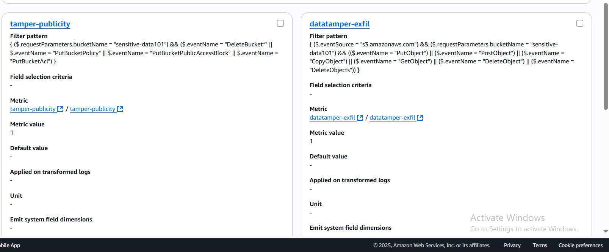

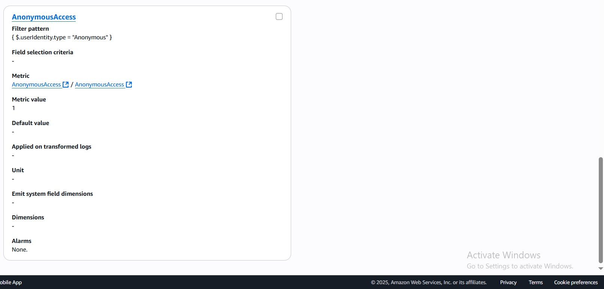

## STEP 5 – CREATING AN SNS TOPIC
-	I created a single SNS topic for all alarms and subscribed my email address.
-	This allowed centralized alerting for all metric filters, making it easy to track all security events in one place.

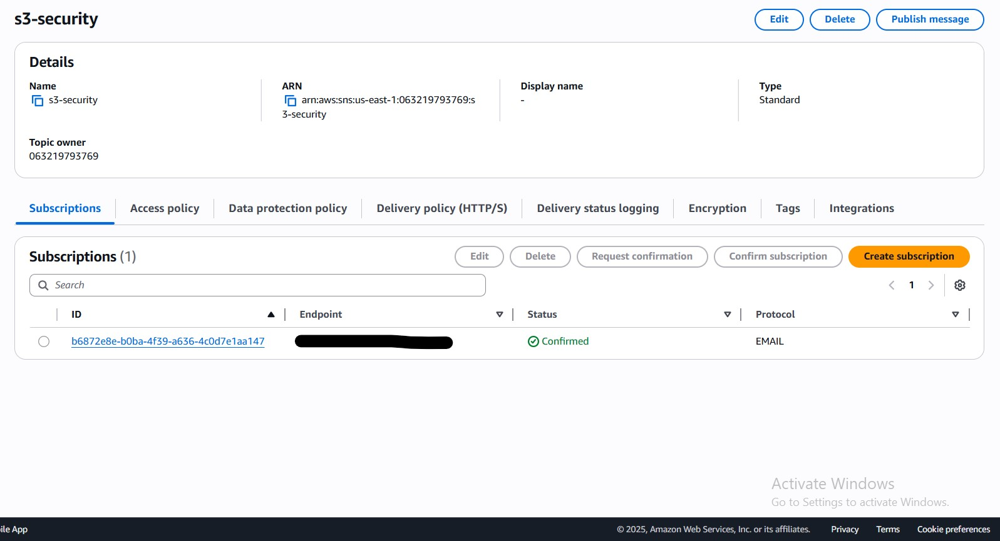

## STEP 6 – CREATING ALARMS
-	I created an alarm for each metric filter using the sns topic I created
-	This made sure to trigger my sns topic which in turn send a notification to the subscribed email 

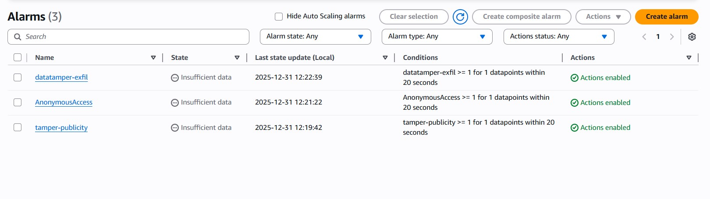

## STEP 7 – TESTING AND VALIDATION
-	I performed several test activities to ensure my setup worked:
-	Uploaded, downloaded, and deleted objects in the bucket
-	Removed Block All Public Access from the bucket
-	Checked CloudTrail logs in CloudWatch and all relevant events appeared
-	Verified that metric filters incremented correctly
-	Confirmed that alarms triggered and SNS notifications were received
-	Everything worked and I was glad to see that.

  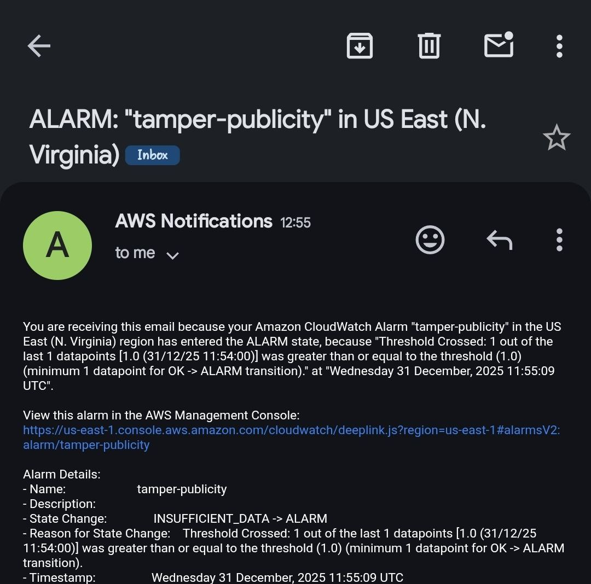

  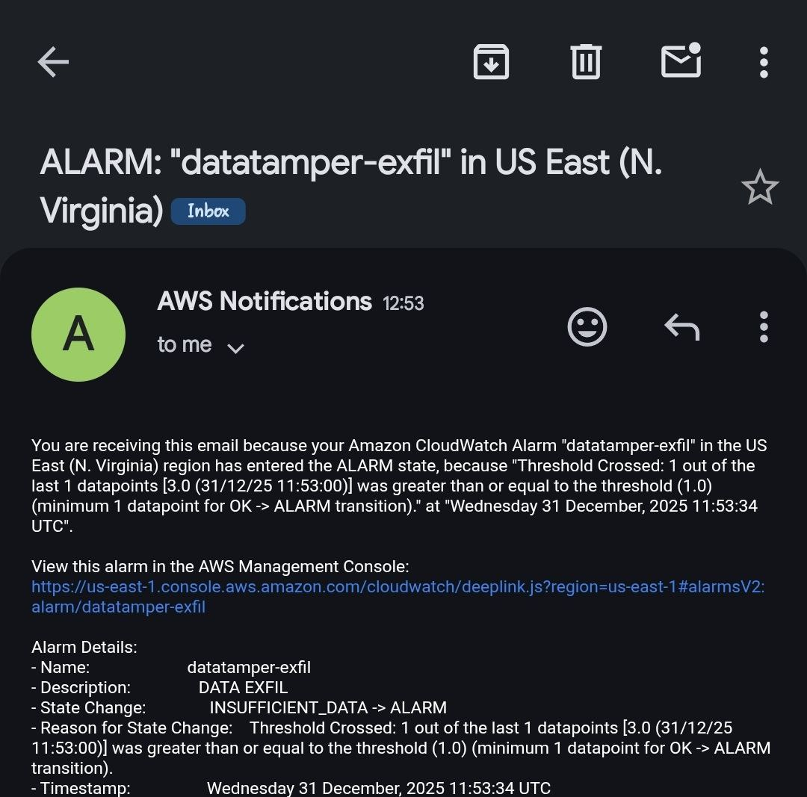

# 
 CONCLUSION

## SECURITY VALUE
Through this project, I gained full visibility into my S3 bucket, including:
-	Public exposure changes
-	Object-level access (uploads, downloads, deletions)
-	Unauthorized anonymous access
-	Near-real-time alerts for suspicious activity
-	This setup mirrors real SOC practices and significantly improves my incident response readiness.

## CHALLENGES
-	Initially, I used the wrong management event filter for public access changes — the correct filter pattern is PutBucketPublicAccessBlock.
-	I noticed a 2–5 minute delay between action and alarm due to CloudTrail delivery and CloudWatch metric evaluation.
-	Metric filters require exact JSON paths to match the bucket name.

## LESSONS LEARNED
-	CloudTrail differentiates management vs data events, which is critical for S3 monitoring
-	When using OR in metric filter, if  an alarm is triggered, it does not indicate which event among the patterns fired the alarm in the email notification. Splitting metrics per event provides better clarity
-	CloudWatch and CloudTrail provides near-real-time monitoring, but Lambda integration is required for sub-minute alerts

# 
ROUGH

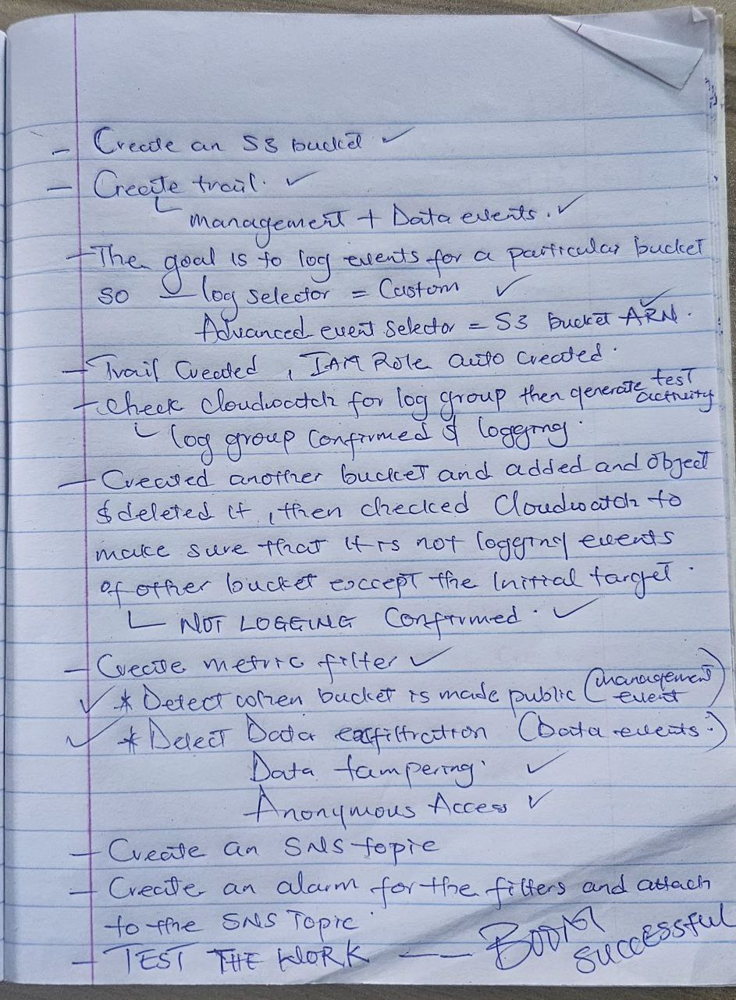
